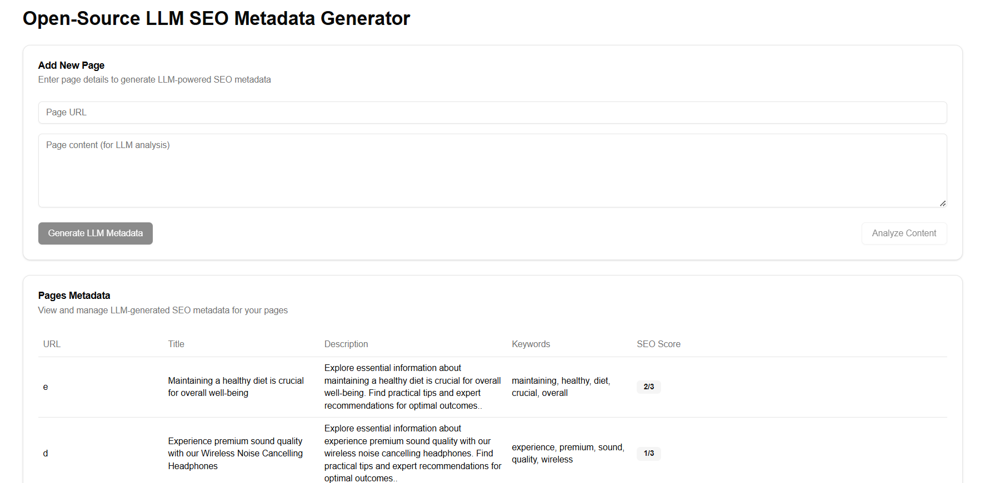

# SmartMeta - AI SEO Metadata Generator

This is the SEO metatdata generator which tooks content of your page and produce SEO friendly metadata and description for your website.

[]

## How it works

It uses an LLM model called [facebook/bart-large-cnn](https://huggingface.co/facebook/bart-large-cnn) to generate SEO metadata. This application gives you the ability to upload content of any website, which will send it through this LLM Model using a Next.js API route, and return your generated metadata for website. The LLM Model is hosted on [HuggingFace](https://huggingface.co/).

## Running Locally

### Cloning the repository the local machine

```bash
git clone https://github.com/Arvind644/smartMeta
```

### Creating a account on HuggingFace to get an API key

1. Go to [HuggingFace](https://huggingface.co/) to make an account.
2. Click on settings in left navbar, and click on "API Tokens".
3. Here you can find your API token. Copy it.

### Storing the API keys in .env

Create a file in root directory of project with `.env.local`. And store your API key in it, as shown in the .example.env file.

### Installing the dependencies

```bash
npm install
```

### Running the application

Then, run the application in the command line and it will be available at `http://localhost:3000`.

```bash
npm run dev
```

## License

This repo is MIT licensed.
